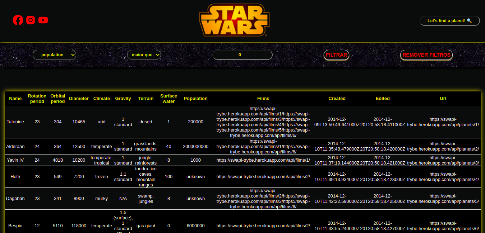

Este projeto contém os requisitos realizados por _[Anna Beatriz Garcia Trajano de Sá](www.linkedin.com/in/anna-beatriz-trajano-de-sá)_ enquanto estudava na [Trybe](https://www.betrybe.com/) :rocket:

# Project Starwars Planets Search

Neste projeto desenvolvi uma lista com filtros de planetas do universo de Star Wars usando Context API e Hooks para controlar os estados globais. Ao empregar 
Context API e Hooks ao meu projeto, pude perceber que:

 - A Context API é uma funcionalidade avançada do React que permite o compartilhamento de estado entre vários componentes, 
   sem que seja necessário passá-lo manualmente através de props. É, muitas vezes, usada como alternativa ao Redux.
  
 - Com React Hooks é possível controlar componentes complexos de forma mais simples e rápida, facilitando o compartilhamento 
   e agrupamento da lógica de cada um;


Veja o exemplo a seguir da demo e do layout do projeto!

## Demo e Layout


Search Page             |         
:-------------------------:|
  |


## Link para o deploy:
 
 [Starwars Planets Search](https://project-starwars-planets-search-green.vercel.app/)<br>
 
## Instalação do projeto localmente:
 
Após cada um dos passos, haverá um exemplo do comando a ser digitado para fazer o que está sendo pedido, caso tenha dificuldades e o exemplo não seja suficiente, não hesite em me contatar em _annagarcia@id.uff.br_ 

1. Abra o terminal e crie um diretório no local de sua preferência com o comando **mkdir**:
```javascript
  mkdir projetos
```

2. Entre no diretório que acabou de criar e depois clone o projeto:
```javascript
  cd projetos
  git clone git@github.com:annabia95/project-starwars-planets-search.git
```

3. Acesse o diretório do projeto e depois utilize o comando **npm i** para instalar todas as dependências necessárias:
```javascript
  cd project-starwars-planets-search
  npm i
```

4. Por último, rode o comando **npm start** e acesse o projeto via browser, no caminho `http://localhost:3000/project-starwars-planets-search`.

```javascript
  npm start
```

## Habilidades Desenvolvidas

Neste projeto, desenvolvi as seguintes habilidades:

 - Utilizar a Context API do React para gerenciar estado;
 - Utilizar o React Hook useState;
 - Utilizar o React Hook useContext;
 - Utilizar o React Hook useEffect;
 - Criar React Hooks customizados.
 
 ## Referências
 [Documentação oficial do React sobre Context API](https://reactjs.org/docs/context.html)<br>
 [API de Referência dos Hooks](https://pt-br.reactjs.org/docs/hooks-reference.html)<br>
 [React Icons](https://react-icons.github.io/react-icons/)<br>
 [Color.review](https://color.review/)<br>
 [VisBug extension](https://chrome.google.com/webstore/detail/visbug/cdockenadnadldjbbgcallicgledbeoc)<br>
 
 
 ## Escopo do Projeto

 - Faça uma requisição para o endpoint /planets da API de Star Wars e preencha uma tabela com os dados retornados, com exceção dos da coluna residents;
 - Filtre a tabela através de um texto, inserido num campo de texto, exibindo somente os planetas cujos nomes incluam o texto digitado;
 - Crie um filtro para valores numéricos;
 - Implemente múltiplos filtros numéricos;
 - Não utilize filtros repetidos;
 - Apague o filtro de valores numéricos e desfaça as filtragens dos dados da tabela ao clicar no ícone de X de um dos filtros.

 

